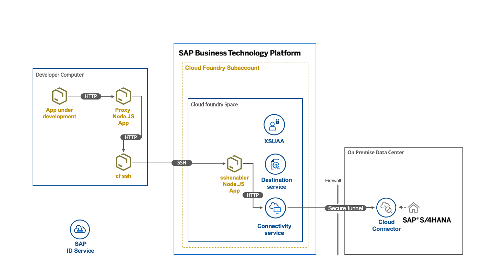

# sap-cf-proxy - proxy to all destinations in SAP BTP Cloud Foundry subaccount

## Why?

You might ask why do I need this project? The answer is whenever you want to work with On Premise Destinations and you don't have a VPN connection which would allow you to connect directly.

## Limitations

The authenticaiton of the SAP BTP Cloud Foundry subaccount must be configured to use SAP ID or SAP Identity Authentication. For SAP Identity Authenticaiton you must have the credentials of a local user.

## How does it work



This proxy makes use of the possibility to connect via ssh into an app (sshenabler) that is running inside the SAP BTP Cloud Foundry environment. From there the so called connectivity proxy is reachable. This proxy is provided by an instance of the Connectivity Service. On your development computer you have to start two programs:

- the script that establishes the ssh tunnel and forwards requests from the local port 20003 and 20004 to connectivityproxy.internal.cf.eu10.hana.ondemand.com:20003 / 20004
- the reverse proxy that by default listens on port 5050 and acts as your local endpoint for calls that should be forwarded to the on premise system

When your local app that you develop e.g. a CAP Application using an external service, a SAPUI5 App or a REST Client Script sends a request to the proxy, it will either use the username / password provided as an basic authentication header or via the environment variables USERNAME / PASSWORD and use that to authenticate on the XSUAA service using the password grant type. In return a JWT is retrieved. This token is sent in the backend request and is translated to the X.509 certificate used for principal propagation in the Cloud Connector. The local reverse proxy sends request for an on premise destination to local port that are forwarded via the ssh tunnel to the proxy in the BTP.

## Prerequisites

You are logged into your SAP BTP Cloud Foundry subaccount via the cf CLI and you have the Multitarget Build Tool installed (mbt). Until [sap-cf-localenv](https://github.com/jowavp/sap-cf-localenv) is setup for the project also jq needs to be installed.

## Setup

Run the following commands in a terminal window:

```
npm i
npm run build:mta
npm run deploy:cf
npm run enable-ssh
npm run start:sshtunnel
```

Remark: The start ssh tunnel is currently forwarding the requests to 'connectivityproxy.internal.cf.eu10.hana.ondemand.com:20003' if you are not in the cf-eu10 region, you have to change this configuration in the package.json file.

Go to the SAP BTP Cockpit and open the details of the deployed app _sshenabler_. Navigate there to the Environment Variables. Copy the content of the textbox _System Provided_ to a local file called _default-env.json_. Then run the following commands in another terminal window:

```
npm start
```

## Proxy Configuration

Following properties can be configured in a .env file in the root folder of the project.

| Property                  | Description                                                                                | Defaul value          |
| ------------------------- | ------------------------------------------------------------------------------------------ | --------------------- |
| PORT                      | Proxy port                                                                                 | 5050                  |
| DESTINATION_PROPERTY_NAME | Header property to define the target destination                                           | X-SAP-BTP-destination |
| DEFAULT_DESTINATION       | If no target destination is set in the request to the proxy we use this destination nama.  | SAP_ABAP_BACKEND      |
| CFPROXY_HOST              | Host where the port-forwarding is running to the CF proxy                                  | 127.0.0.1             |
| CFPROXY_POST              | Port that is forwarded to the CF proxy                                                     | 20003                 |
| USERNAME                  | Username in cloud foundry, if no user is set you have to send an authorization header.     |
| PASSWORD                  | Password in cloud foundry, if no password is set you have to send an authorization header. |

## Testing

Using the VS Code Extension [REST Client](https://marketplace.visualstudio.com/items?itemName=humao.rest-client) you can execute the test in test/ping.http. Before you can run the test you have to create a .env file in the test folder with the following (of course adjusted) content:

```
sapcpproxy=http://localhost:5050
sapid_username="<user-email>"
sapid_password="<password>"
```

Connect a Cloud Connector to your Subaccount and create the following destinations:

- SAP_ABAP_BACKEND_NO_AUTH
- SAP_ABAP_BACKEND_BASIC_AUTH

Then run the test. The result should be:

`<html><body>Server reached.</body></html>`

in both cases.
